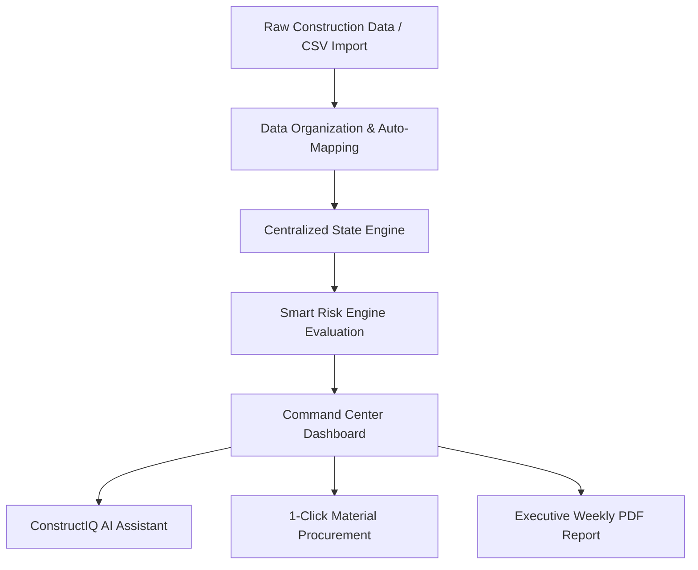

# ConstructIQ — Development Documentation

**Task 07: Smart Construction Data Management**  
*LJ University B.Tech Hackathon 2026 — Real-World Product Innovation Challenge*

---

## 1. Problem and Opportunity

### The Problem
The construction and real-estate industry in India faces massive project overruns and financial leakages:
- **Data Fragmentation:** Construction telemetry (site progress, daily labour counts, material deliveries, vendor invoices) is trapped across disconnected Excel spreadsheets, paper registers, and unstructured WhatsApp groups.
- **Reactive Management:** Delay and budget overruns are typically detected 3–6 weeks after the failure event occurred, making corrective action costly or impossible.
- **Opacity & Friction:** Site engineers, project managers, procurement heads, and real-estate developers operate without a single, unified source of truth.

### The Opportunity
By unifying fragmented site data into an intelligent, explainable data management platform, real-estate developers can reduce project delays by up to 25%, eliminate material stockouts, and optimize cash flow forecasting across multi-site portfolios.

---

## 2. Proposed Solution

**ConstructIQ** is an end-to-end AI-powered Construction Data Intelligence Platform designed to convert scattered construction data into explainable risk alerts, automated material procurement recommendations, and executive reports.

Key Innovations:
- **Centralized Data Layer:** Normalizes tasks, materials, expenses, issues, and documents across portfolio sites.
- **Explainable Smart Risk Engine:** Calculates a transparent 0–100 risk score with mathematical line-item breakdowns.
- **Automated Procurement Triggers:** Detects low material inventory and generates purchase requests in 1 click.
- **Conversational AI Assistant:** Allows project managers to query site data using natural language with instant source attribution.

---

## 3. Product Concept

ConstructIQ operates as a high-performance commercial enterprise SaaS application. The core philosophy is **"Data -> Decisions"**:
1. **Data:** Ingest telemetry via web forms or automated CSV imports.
2. **Organize & Track:** Map activities against baseline schedules and minimum inventory thresholds.
3. **Analyze & Risk Detection:** Evaluate delay scores, cost variances, and stockout probabilities.
4. **Manager Action & Report:** Trigger automated procurement orders and export printable executive PDF reports.

---

## 4. Key Features

1. **Operations Command Center (Dashboard):**
   - KPI cards for Active Projects (5), Overall Progress (68%), Budget Utilization (83%), Open Issues (7), and Material Risk (HIGH).
   - Featured Hero Project card (*Ahmedabad Smart Residency*) displaying completion date (31 Mar 2027), budget (₹10 Cr), spend (₹8.3 Cr), and physical progress.
   - Portfolio overview table displaying all 5 active sites with live status badges.

2. **Explainable Smart Risk Engine:**
   - Rule-based risk score (0–100) calculated from 5 transparent factors:
     - Progress below plan / delayed task (+30)
     - Overdue task (+10)
     - Material below minimum threshold (+20)
     - Forecast budget overrun (+15)
     - Low workforce availability (+0)
   - Hero project displays **exactly 75/100 HIGH RISK** with visible rows summing to 75.

3. **Material & Inventory Control:**
   - Live inventory tracking for Cement, Steel, Bricks, Sand, Tiles, and Paint.
   - Automated **LOW STOCK ALERT** when Steel falls below 15 tons (Current: 12 tons).
   - 1-click **"Create Material Request (6 Tons)"** modal and purchase order log.

4. **Task Progress & Schedule Management:**
   - Detailed task grid with search and status filtering (Completed, In Progress, Delayed, Pending, Blocked).
   - Highlighting delayed tasks (*Electrical Installation 45% DELAYED, due 20 Sep 2026*).

5. **Budget & Expense Intelligence:**
   - Planned vs Actual cost breakdown by category (Materials, Labour, Equipment, Contractor).
   - High Budget Risk forecast card displaying predicted final cost (₹10.8 Cr) and potential overrun (₹80 Lakh).

6. **ConstructIQ AI Assistant (`/assistant`):**
   - Conversational chat interface answering questions regarding project delays, material shortages, and budget overruns.
   - Displays **"Sources used: Tasks, Materials, Expenses"** tags and working action buttons inside answers.

7. **Data Import & Organization Center (`/import`):**
   - Drag-and-drop CSV parser.
   - **"Load Sample Messy Spreadsheet"** feature demonstrating raw input auto-mapping to clean system schemas.

8. **Automated Weekly Report Generator (`/report`):**
   - Formatted weekly audit document for *Ahmedabad Smart Residency* (14–20 September 2026).
   - Built-in `window.print()` functionality with dedicated print CSS stylesheet.

9. **Global Command Palette (Ctrl+K):**
   - Accessible from any screen to search across projects, tasks, materials, issues, and documents.

---

## 5. Technology and Tools Used

- **Frontend Core:** React 19, JavaScript (ES6+), HTML5.
- **Styling & System Tokens:** Tailwind CSS v4, Vanilla CSS variables, custom glassmorphism & dark-mode palettes.
- **Data Visualization & Charts:** Recharts (LineChart, BarChart, PieChart/Donut).
- **Icons & UI Components:** Lucide-React.
- **Build System & Dev Server:** Vite 8.
- **State Management & Persistence:** React Context API (`AppContext`) with `localStorage` state synchronization.

---

## 6. Development Approach

- **User-Centric Prototyping:** Built directly on top of the Lovable design framework to maintain exact visual language, card styling, and typography.
- **Single Source of Truth Data Model:** Centralized state in `/src/data/mockData.js` and `/src/context/AppContext.jsx` ensures complete numerical consistency across all 12 views.
- **Component-Driven Architecture:** Modular component structure divided into `/layout`, `/common`, and `/views`.

---

## 7. Product Workflow

---

## 8. Challenges and Solutions

| Challenge | Solution |
| :--- | :--- |
| **Numerical Mismatches Across Pages** | Implemented a single centralized `AppContext` store so KPI metrics, open issue counts, and budget numbers match across all 12 pages. |
| **Unexplainable "Black-Box" Risk Scores** | Designed a transparent, rule-based risk evaluation model in `riskEngine.js` where visible line items explicitly sum to the total score (75/100). |
| **Print Styling Mismatches** | Added dedicated `@media print` rules to strip navigation bars and format reports as clean corporate PDFs. |

---

## 9. Future Scope

- **BIM 3D Model Integration:** Linking CAD/BIM IFC files to task completion percentages.
- **IoT Sensor Feeds:** Integrating concrete curing temperature sensors and RFID material site tracking.
- **Tally & ERP Sync:** Direct two-way sync with Tally Prime and SAP ERP for vendor invoicing.
- **WhatsApp Integration:** Bot interface allowing site engineers to submit daily progress logs via voice notes.
