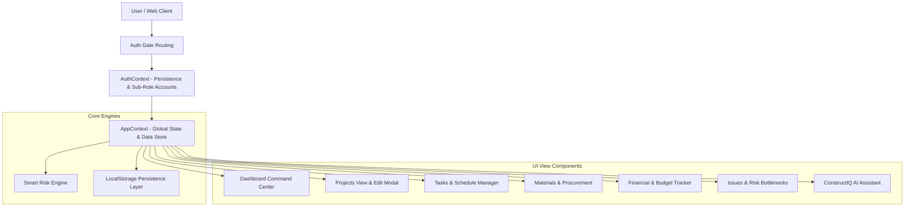

# ConstructIQ — Software Engineering & Architecture Documentation

## 1. Executive Summary & System Overview

**ConstructIQ** is an enterprise-grade Smart Construction Data Management & Intelligence Platform built to solve data fragmentation, delayed risk detection, and operational opacity across civil construction projects.

The platform provides:
- **Centralized Data Aggregation**: Real-time synchronization across projects, tasks, material inventory, expense tracking, site issues, and compliance documentation.
- **Explainable Risk Engine**: Automated score computation (0-100) analyzing schedule slippage, budget overruns, low stock inventory thresholds, and open site risks.
- **Dynamic Role-Based Access Control (RBAC)**: Custom operational capabilities for System Administrators, Project Managers, Site Engineers, and Executive Leadership.
- **Automated Sub-Role Provisioning**: Real-time generation of default team credentials (PM, SE, EM) during initial system registration.

---

## 2. Architecture & Technology Stack



### Core Stack
- **Framework**: React 18 (Vite Bundler)
- **Styling**: Vanilla CSS + Tailwind CSS utility styling (Custom HSL color palette)
- **Iconography**: Lucide React
- **Data Visualization**: Recharts (Line, Bar, Area, Component Charts)
- **State Persistence**: HTML5 LocalStorage with automatic schema fallback

---

## 3. Authentication & Sub-Role Auto-Provisioning (RBAC)

ConstructIQ implements a role-based authentication model supporting four roles:
1. **System Administrator (`admin`)**: Full platform authority, workspace setup, team credential management.
2. **Project Manager (`pm`)**: Site operations, editing assigned project parameters, risk management, material approvals.
3. **Site Engineer (`site_eng`)**: Field task updates, daily site logs, photo inspection, material procurement requests.
4. **Executive Leadership (`management`)**: Portfolio-level financial health, cross-project task management, executive analytics.

### Automatic Sub-Role Account Generation on Signup
When registering a new System Admin account with email `admin@domain.com`:
- If sub-role account credentials are not manually typed, the system automatically derives team login IDs:
  - **Project Manager**: `adminpm@domain.com` (Default Password: `pm123`)
  - **Site Engineer**: `adminse@domain.com` (Default Password: `eng123`)
  - **Executive Leadership**: `adminem@domain.com` (Default Password: `exec123`)
- Accounts are created and stored immediately in `localStorage` under `constructiq_users`, enabling immediate login by team members.

---

## 4. Entity Schema & Data Architecture

### 4.1 Project Schema (`projects`)
```json
{
  "id": "p_1726850000000",
  "name": "Ahmedabad Smart Residency Phase 2",
  "client": "Prestige Group Ltd",
  "location": "Sarkhej-Gandhinagar Highway, Ahmedabad, Gujarat",
  "budget": 75000000,
  "spent": 24000000,
  "progress": 35,
  "status": "On Track",
  "riskLevel": "LOW",
  "startDate": "2026-03-01",
  "targetDate": "2027-12-31",
  "manager": "Rohan Mehta",
  "siteEngineer": "Vikram Patel",
  "category": "Commercial Infrastructure"
}
```

### 4.2 Task Schema (`tasks`)
```json
{
  "id": "t_001",
  "name": "Foundation Excavation & Piling",
  "projectId": "p_001",
  "projectName": "Ahmedabad Smart Residency",
  "assignedTo": "Vikram Patel",
  "progress": 80,
  "dueDate": "2026-10-15",
  "priority": "High",
  "status": "In Progress",
  "category": "Civil Works"
}
```

### 4.3 Material & Request Schema (`materials`, `materialRequests`)
```json
{
  "id": "m_001",
  "name": "Fe550 TMT Steel Bars (12mm)",
  "category": "Steel",
  "available": 12,
  "unit": "tons",
  "minLevel": 15,
  "unitPrice": 62000,
  "supplier": "Tata Tiscon Direct",
  "projectId": "p_001"
}
```

---

## 5. Explainable Risk Engine Logic

The **Smart Risk Engine** calculates a composite risk score ($R \in [0, 100]$) using five weighted components:

$$R = w_1 S + w_2 B + w_3 M + w_4 I + w_5 W$$

1. **Schedule Variance ($S$, max 30 pts)**: Proportion of delayed or overdue tasks.
2. **Budget Overrun Forecast ($B$, max 30 pts)**: Ratio of predicted final cost to allocated budget.
3. **Material Stock Risk ($M$, max 20 pts)**: Count of materials below minimum safety thresholds.
4. **Unresolved Open Issues ($I$, max 15 pts)**: Critical and High-priority open site bottlenecks.
5. **Weather / External Factors ($W$, max 5 pts)**: Adverse weather alerts or contractor performance flags.

---

## 6. Software Quality, Build & Deployment

- **Build Script**: `npm run build` (`vite build`)
- **Linting & Code Integrity**: Verified zero runtime reference errors or undefined variables.
- **Cross-Browser Support**: Tested on Chromium-based browsers (Chrome, Edge) and mobile viewports.

---
*Authored by sahilgohill for ConstructIQ Hackathon Repository.*
